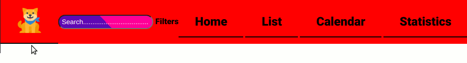

You have been adding buttons to your project, and then nesting elements, such as divs inside your buttons. HTML is not designed to work this way. A button, by default, is displayed as inline-block and you should not nest block elements inside inline -type elements.
I've posted a summary of the nesting rules here.
You can open the Extensions pane (Ctrl-Shift-X for eXtensions) and use the search bar to find "W3C validation". I've installed W3C Web Validator by Celian Riboulet, and it finds 28 errors, mostly related to buttons.


---

The elements you nest inside the `<button>` elements are all for navigation, so it would make sense to use a `<nav>` tag instead.

You show the same group of 4 links inside 4 different containers, one for each `:target`-able section. There is an important principle with the acronym DRY: Don't Repeat Yourself.

Question: Why don't you create one `<nav>` element, place it outside the `<main>` element, and give it a `position` attribute of `fixed`?

Answer: Because you have this rule...
```css
:target ~ :nth-child(n) {
    display: none;
}
```
... which hides it.

What does the selector for this rule say? (`:target ~ :nth-child(n)`)
If there is a "target", and it has a younger sibling which is at any position `(n)`, then apply the rule. And the rule is "hide the selected element". How could you change this rule so that:

* It only applies to elements of type `section`
* It only applies to the youngest sibling of the "target" section?

---

Your rule `section:nth-child(1n)` is more complicated than necessary. Simply `section` will have the same effect. The `(1n)` counter says "for every value of `n`, apply this rule. It makes sense to use values other than `1`. For example, `:nth-child(2n)` means "with every value of `n`, the result is `2 x n`, so apply this rule to children 2, 4, 6, 8, ... and so on.

---

When you roll over a button in the menu bar at the top, you add a border to the left and right, and the width of the button changes. You think that this shouldn't happen because you have a rule: `* {box-sizing: border-box}`, and you understand that this ensures that the outside dimensions of the box around each element will always be maintained.

Question: By default, what determines the width of an element with `display: inline-block;`?
Question: For an element with `display: inline-block;` is there any available space for a border *inside* the default width?
Question: When you add a border to an element which is already as narrow as it can be, where will the border go: inside or outside?

For `div.menu` you use `display: flex;justify-content: space-between;`.

When my browser is displayed at 100% and the width of the window is about 925 pixels, all the elements in the menu bar are as closely packed as they can be. There is zero space-between the elements. When I roll the mouse over one of the buttons, the border on the left and right increases its width, which reduces the width available for the other elements in the `flex` box, so they wrap to the next line.



How can you fix this? What happens if you set a border with a fixed width at all times, but make it transparent (except on `:hover`)?

---

You are using CSS variables to set the colour scheme of your page, but you did not change the name of the variables when you changed them all from various shades of green to a purple-and-pink gradient pattern. This will be very confusing to you in a few weeks time, when you will have forgotten that you did it.

Perhaps if you use a more generic name such as "colour1" instead of "green1", when you make a change to the colour, its name will still be relevant. Because `color` has a specific meaning in CSS, it might be better to use the UK spelling for a variable name, to differentiate it clearly.

Note that you can use CSS variables as soon as they have been declared, so you can use CSS variables in your definition of other CSS variables.

The term [refactoring](https://en.wikipedia.org/wiki/Code_refactoring) refers to the practice of keeping your code clean (improving variable names, removing unnecessary lines, grouping similar rules and functions together, and so on) so that it is easier to read and maintain.

---

You define a CSS variable for a purple-and-pink gradient pattern, and then you then use the same purple-and-pink gradient pattern for the background for the search field and the `:hover` state for the Contact buttons ... but in these two places, you do not use the CSS variable you created for this very purpose. Instead you redefine it (using a different colour format). According to the DRY principle, this is an error. It makes it harder to make modifications to your site in the future.

---

You have placed a `main` element inside `<section id="main1>`. The `<main>` element is intended as a container for all the non-nav, non-aside, non-header, non-footer, non-advertising content. There should only be one `<main>` element on a page.

Should you have a `<main>` element inside each `<section>`, or should you have all your `<section>`s inside one `<main>`?

---

Your nav bar is pushed off the screen when you click on the Home button, because the browser wants to place `<section id="main1">` as the target element at the top of the viewport, and the nav bar is part of the standard flow of the document.

What value for `position` can you give to the nav bar, so that it retains a fixed position with respect to the viewport?

What `height` should the nav bar be? How much `padding` will you need to give at the top of each `section`, so that the beginning of the non-padding content appears exactly at the bottom of the nav bar?

---

If a section is longer than the available height, a scroll bar will appear. By default, this will be attached to the `<body>` element, and so it will appear the entire height of the viewport, including the non-scrollable nav bar.

By default, every `block` element will be just the right height to fit its content. Each `<section>` element will take up as much height as its content requires, and the `<body>` will take up as much height as the currently-displayed `<section>` requires.

How can you limit the height required by a `<section>` to the-height-of-the-viewport minus the-height-of-the-nav-bar?

If you used a CSS variable to set the height of the nav bar, what `calc()` expression could you use to determine how much height is left in the viewport?

If you wrapped all the contents of a `<section>` inside a generic `<div>` whose height is set to the-height-available-after-accounting-for-nav-bar, what will the height of the `<section>` be? Which element will show a scrollbar if you set `overflow: auto` on it?

---

You use `body { font-family: roboto; }`. What would happen if `fonts.googleapis.com` was down, and the Roboto font could not be found? Which is the font that your browser will use by default? Does this look anything like Roboto? What type of font is Robot — serif, sans-serif, monospace, cursive or fantasy?

How can you tell your browser [which fonts](https://www.cssfontstack.com/) it should fall back on, if the requested font is not available? And if none of these fonts are available, what type of font should the browser choose?

---

You have used...
```css
.div-date-img {
  margin-bottom: -4px;
  padding-bottom: 0;
}
```
... to get rid of the gap that appears between the bottom of your image and the border at the bottom of the `div`. When you understand why this gap is there, you will find a better way to make it go away.

[Image inside div has extra space below the image](https://stackoverflow.com/a/5804278)

Note that you will have to alter your rule so that it applies to the `img` and not to the container `div`.

---

UNTREATED ISSUE:

If the viewport is too narrow, the items in the menu bar will wrap to a second line, or more. This will make the nav bar overlap the main content. There are several ways to treat this issue:

* Use an @media query to alter the amount of padding applied to the `<section>` elements, depending on how much space the nav bar needs to take.
* Use an @media query to replace the words in the menu with icons, which will take up less width
* Use `vw` units to change the `font-size` and `width` of the elements in the menu bar
* Minimize the width of the Search element, unless it is actually being used.

---

In my Pull Request, I have eliminated many of your commented-out lines, where I felt that these were traces of ideas that you no longer want to follow up on. I also removed places where you set `margin` to a negative number, because this looked like a hack which is better solved in a different way.
